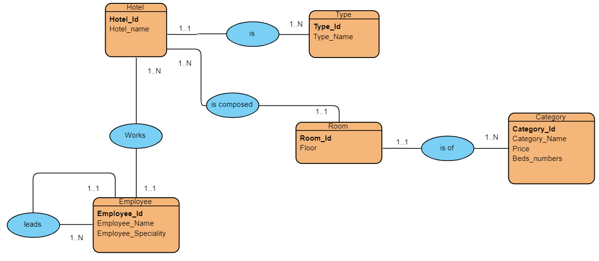

## Objectives

In this Task, we're going to Convert the  entity relationship model to a relational diagram.

### Instructions
After the construction of his hotels in one of the tourist areas, a director wishes to prepare a database to facilitate the management of his data.

The director has presented the following information to you through the entity relationship model.

